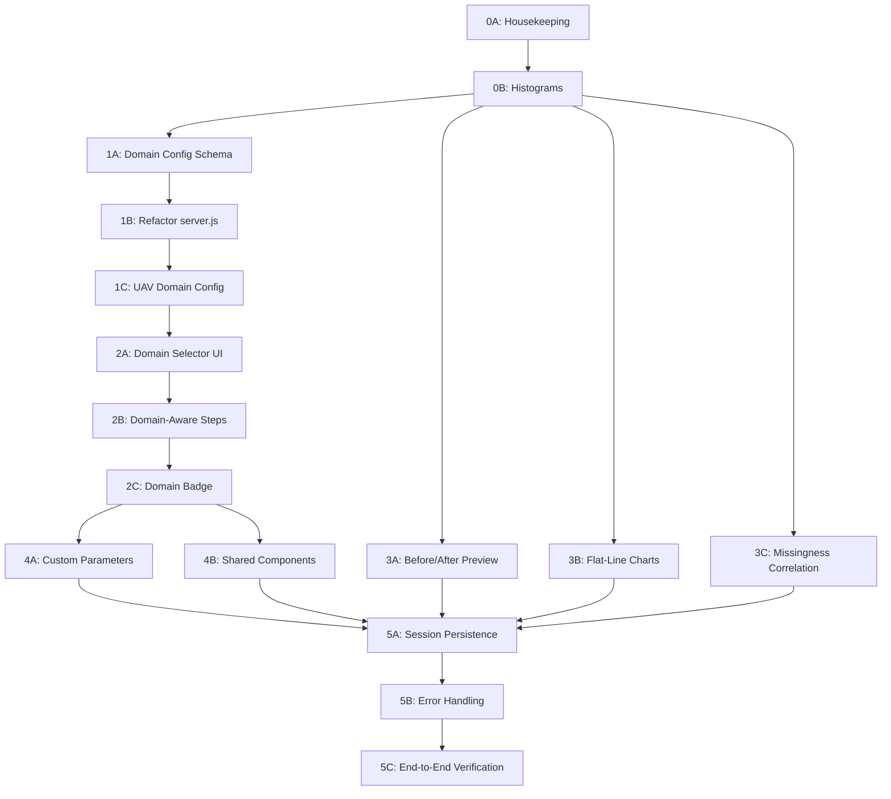

# DT-QUEST — Step-by-Step Build Prompts

> **How to use:** Work through each prompt sequentially. Copy-paste the prompt into a new Antigravity conversation. Each prompt is self-contained with full context. Check off items as you complete them.
>
> **Reference:** See `AUDIT_REPORT.md` for the full project audit.

---

## Master Checklist

### Phase 0 — Housekeeping & Bug Fixes
- [x] **Prompt 0A** — Clean up dead code, fix proxy mismatch, delete unused Python backend
- [x] **Prompt 0B** — Render per-parameter histograms in Step 1 (Range)

### Phase 1 — Domain Plugin System (Backend)
- [x] **Prompt 1A** — Create domain config YAML schema + ITS/V2X config + registry loader
- [x] **Prompt 1B** — Refactor server.js to load ranges/presets/rules from domain configs
- [x] **Prompt 1C** — Create UAV domain config with parameters, ranges, presets, and rules

### Phase 2 — Domain-Aware Frontend
- [x] **Prompt 2A** — Add domain selector to Upload step + dynamic column mapping
- [x] **Prompt 2B** — Make validation steps domain-aware (dynamic labels, conditional Path Loss tab)
- [x] **Prompt 2C** — Add domain badge to sidebar + domain info panel

### Phase 3 — Missing Frontend Features
- [x] **Prompt 3A** — Add before/after data preview to Step 6 (Clean/Export)
- [x] **Prompt 3B** — Add flat-line time-series charts to Step 3 (Constants)
- [x] **Prompt 3C** — Add missingness correlation matrix to Step 4 (Completeness)

### Phase 4 — Custom Parameters & Extensibility
- [x] **Prompt 4A** — Add "Custom Parameter" support in column mapping
- [x] **Prompt 4B** — Extract shared components (SummaryCard, DataTable, ChartCard, StepHeader)

### Phase 5 — Robustness & Polish
- [x] **Prompt 5A** — Add session persistence (file-based JSON storage)
- [x] **Prompt 5B** — Add error boundaries, loading skeletons, toast notifications
- [x] **Prompt 5C** — End-to-end verification + create verification guidegressions

---

## Prompt 0A — Housekeeping & Bug Fixes

```
# DT-QUEST — Housekeeping & Bug Fixes

I have a DT-QUEST web app in the `dt-quest` folder with a React frontend and Express backend. Before adding new features, clean up the codebase:

## Tasks

### 1. Delete the unused Python backend
- Delete `backend/main.py` and `backend/requirements.txt` and `backend/__pycache__/`
- The project uses ONLY the Node.js/Express `server.js` backend

### 2. Fix Vite proxy mismatch
In `frontend/vite.config.js`, there's a proxy configured for `/api` but `frontend/src/utils/api.js` calls `http://localhost:8000` directly. Fix this one of two ways:
- **Option A (recommended):** Remove the proxy config from vite.config.js since we're calling the backend directly
- Update the comment in api.js to note the direct connection

### 3. Add a proper .gitignore
Create `dt-quest/.gitignore` with:
- node_modules/
- dist/
- build/
- __pycache__/
- *.pyc
- .env
- uploads/

### 4. Add a README.md
Create `dt-quest/README.md` with:
- Project title and one-line description
- Tech stack (Express + React + Vite + TailwindCSS + Recharts)
- How to install and run (npm install in both dirs, npm run dev)
- Backend port: 8000, Frontend port: 3000

### Constraints
- Do NOT modify any component logic or validation code
- Only cleanup and documentation
```

---

## Prompt 0B — Render Per-Parameter Histograms in Step 1

```
# DT-QUEST — Add Distribution Histograms to Range Check (Step 1)

In `dt-quest/frontend/src/components/RangeCheck.jsx`, the backend already returns histogram data for each parameter (`info.histogram.counts` and `info.histogram.bins`), but the frontend doesn't render it.

## Task
When a user clicks on a parameter row to expand it (the `selectedParam` state is already implemented), add a distribution histogram chart below the existing stats grid.

### Requirements
1. Use Recharts BarChart to render `info.histogram.counts` (bar heights) against `info.histogram.bins` (bin edges)
2. Add vertical reference lines at `info.valid_range.min` and `info.valid_range.max` (the 3GPP bounds) using Recharts `ReferenceLine` — color them green
3. Chart should be ~200px tall, inside the expandable parameter detail section
4. Bars should be colored:
   - Green for bins within the valid range
   - Red for bins outside the valid range
5. Match the dark theme: background transparent, grid stroke #374151, axis stroke #9ca3af
6. Add axis labels: "Value" on X-axis, "Count" on Y-axis

### File to modify
- `frontend/src/components/RangeCheck.jsx`

### Do NOT
- Change any backend code
- Modify any other component
- Change the existing compliance bar chart or summary cards
```

---

## Prompt 1A — Domain Config Schema + ITS/V2X Config + Registry

```
# DT-QUEST — Create Domain Plugin System (Config + Registry)

The DT-QUEST backend (`dt-quest/backend/server.js`) currently has parameter ranges, presets, and validation rules hardcoded. I need a domain plugin system where each domain (ITS/V2X, UAV, etc.) defines its own config.

## Task

### 1. Install js-yaml
Run `npm install js-yaml` in the `backend/` directory.

### 2. Create directory structure
```
backend/domains/
├── registry.js
├── its-v2x/
│   └── config.yaml
└── _template/
    └── config.yaml    (blank template for new domains)
```

### 3. Design config.yaml schema
Create `backend/domains/_template/config.yaml` as a documented template:

```yaml
domain:
  id: "domain-id"           # unique kebab-case identifier
  name: "Domain Display Name"
  description: "One-line description"
  version: "1.0.0"
  icon: "🔧"                # emoji for UI

parameters:
  - key: "param_key"        # internal key used in mapping
    label: "Display Label"
    unit: "unit string"
    category: "category"    # e.g., "signal", "location", "metadata"
    required: false
    range:
      min: -100
      max: 100
    description: "What this parameter represents"

presets:
  preset_id:
    name: "Preset Display Name"
    description: "Dataset this preset is for"
    mappings:
      param_key: "Column Name In CSV"

consistency_rules:
  - id: "rule_id"
    name: "Rule Display Name"
    description: "What this checks"
    type: "relationship"     # "relationship" | "correlation" | "custom"
    # For relationship type: derived = component_a <operator> component_b
    formula:
      derived_param: "snr"
      component_a: "rx_power"
      component_b: "noise_power"
      operator: "subtract"   # "subtract" | "add" | "ratio"
    tolerance_db: 3
    # For correlation type:
    # correlation:
    #   param_a: "altitude"
    #   param_b: "rssi"
    #   expected_direction: "negative"  # "positive" | "negative"
    #   min_abs_correlation: 0.3

unit_detection:
  - param_key: "rx_power"
    expected_scale: "dbm"
    rules:
      - condition: "min > 0 AND max < 10"
        detected: "linear_watts"
        message: "Likely linear watts — needs 10*log10() conversion"
      - condition: "min < -200"
        detected: "suspicious_offset"
        message: "Suspiciously low — possible offset error"
      - condition: "min < 0"
        detected: "dbm"
        message: "Appears to be in dBm"

reference_models:
  - id: "model_id"
    name: "Model Name"
    frequency_ghz: 5.9
    x_param: "distance"
    y_param: "path_loss"
    equation: "38.77 + 16.7 * log10(d)"
    color: "#f59e0b"
    dash_pattern: "5 5"

readiness_weights:
  range_compliance: 0.25
  cross_param_consistency: 0.25
  no_placeholders: 0.15
  completeness: 0.25
  unit_consistency: 0.10
```

### 4. Create ITS/V2X config
Create `backend/domains/its-v2x/config.yaml` by extracting ALL the currently hardcoded data from server.js:
- All 10 parameters from PARAMETER_RANGES (snr, rsrp, rssi, noise_power, tx_power, rx_power, path_loss, distance, latitude, longitude)
- All 3 presets (tihan_v2i, berlin_sidelink, berlin_cellular)
- Consistency rule: SNR = Rx_Power - Noise_Power with ±3dB
- Unit detection rules for rx_power, noise_power, tx_power
- 3 reference models: FSPL, 3GPP V2V LOS, 3GPP V2V NLOS
- Current readiness weights

### 5. Create registry.js
Create `backend/domains/registry.js` that:
- On import, scans `domains/` for subdirectories containing `config.yaml`
- Parses each config.yaml using js-yaml
- Validates required fields exist (domain.id, domain.name, parameters)
- Exports: `getAllDomains()`, `getDomain(domainId)`, `getDefaultDomain()`
- The default domain should be `its-v2x`
- Log which domains were loaded on startup

### Do NOT
- Modify server.js yet (that's the next prompt)
- Create the UAV domain yet (that's a later prompt)
- Touch any frontend code
```

---

## Prompt 1B — Refactor server.js for Domain Configs

```
# DT-QUEST — Refactor server.js to Use Domain Configs

The domain registry system is now in `backend/domains/registry.js` with the ITS/V2X config in `backend/domains/its-v2x/config.yaml`.

## Task
Refactor `backend/server.js` to load parameter ranges, presets, and validation rules from the domain config instead of hardcoded constants.

### 1. New endpoints
Add these new routes:
- `GET /domains` — returns list of available domains (id, name, description, icon) from registry
- `POST /session/:sessionId/domain` — sets the active domain for a session (store domainId in datasets[sessionId])

### 2. Modify existing endpoints

**`GET /presets`** — Accept optional `?domain=its-v2x` query param. Return presets for that domain (default: its-v2x).

**`GET /parameter-ranges`** — Same, accept `?domain=` query param. Return that domain's parameters as the current object format.

**`POST /upload`** — Add `domainId` field to the stored session data (from request body or default to 'its-v2x').

**`POST /mapping/:sessionId`** — No change needed.

**`POST /pipeline/step1/:sessionId` (Range):**
- Read PARAMETER_RANGES from the session's domain config instead of the hardcoded const
- Everything else stays the same

**`POST /pipeline/step2/:sessionId` (Consistency):**
- Read the consistency_rules from the domain config
- For `type: "relationship"` rules: dynamically get component_a and component_b from the mapping, apply the operator, compare to the derived_param
- For `type: "correlation"` rules: compute Pearson correlation between the two params, check direction and minimum
- Keep the Mode A / Mode B dual-analysis for "relationship" type rules
- If no consistency rules exist for the domain, return `{status: "skipped", reason: "No consistency rules defined for this domain"}`

**`POST /pipeline/step5/:sessionId` (Units):**
- Read unit_detection rules from the domain config instead of hardcoding power params
- Apply the condition rules from YAML to determine detected scale

**`GET /path-loss-analysis/:sessionId`:**
- Read reference_models from the domain config
- If no reference models exist, return `{status: "not_available", reason: "No reference models for this domain"}`
- Dynamically generate model curves from the equation strings

**`calculateReadinessScore()`:**
- Read readiness_weights from the domain config

### 3. Remove hardcoded constants
Delete the hardcoded `PARAMETER_RANGES`, `PRESETS` constants from server.js. All data should come from domain configs.

### 4. Backward compatibility
- If no domain is specified, default to 'its-v2x'
- Existing API calls without domain param should work exactly as before

### Constraints
- The ITS/V2X flow must produce identical results to the current version
- Do NOT touch frontend code
- Do NOT create new domain configs (UAV comes later)
```

---

## Prompt 1C — Create UAV Domain Config

```
# DT-QUEST — Create UAV Domain Configuration

The domain plugin system is now working with `backend/domains/registry.js` loading YAML configs. The ITS/V2X domain works. Now create the UAV domain.

## Task
Create `backend/domains/uav/config.yaml` with the following:

### Parameters (with realistic ranges)
| Key | Label | Unit | Category | Min | Max | Required |
|-----|-------|------|----------|-----|-----|----------|
| rssi | RSSI | dBm | signal | -100 | -20 | true |
| snr | SNR | dB | signal | -5 | 40 | false |
| link_quality | Link Quality | % | signal | 0 | 100 | false |
| altitude_msl | Altitude MSL | m | flight | 0 | 120 | true |
| altitude_agl | Altitude AGL | m | flight | 0 | 120 | false |
| ground_speed | Ground Speed | m/s | flight | 0 | 30 | false |
| vertical_speed | Vertical Speed | m/s | flight | -10 | 10 | false |
| battery_voltage | Battery Voltage | V | power | 10.0 | 25.2 | false |
| battery_current | Battery Current | A | power | 0 | 60 | false |
| gps_hdop | GPS HDOP | - | location | 0.5 | 20 | false |
| gps_num_sats | GPS Satellites | count | location | 0 | 32 | false |
| distance_to_home | Distance to Home | m | location | 0 | 5000 | true |
| latitude | Latitude | degrees | location | -90 | 90 | true |
| longitude | Longitude | degrees | location | -180 | 180 | true |
| heading | Heading | degrees | flight | 0 | 360 | false |
| timestamp | Timestamp | any | metadata | null | null | false |
| vehicle_id | Vehicle ID | any | metadata | null | null | false |

### Presets
1. **ardupilot_tlog** — "ArduPilot Telemetry Log": Map keys to common ArduPilot column names
2. **dji_csv** — "DJI Flight Record CSV": Map keys to common DJI export column names
3. **px4_ulog** — "PX4 ULog Export": Map keys to common PX4 column names

### Consistency Rules
1. **link_budget_check** (correlation type): RSSI should negatively correlate with distance_to_home (min_abs_correlation: 0.3)
2. **altitude_gps_check** (correlation type): altitude_msl should positively correlate with gps_hdop (higher altitude → GPS often better or worse depending on environment, so use min 0.1)
3. **battery_discharge** (correlation type): battery_voltage should negatively correlate over time / with distance_to_home (battery drains as drone flies)

### Unit Detection
- rssi: same logic as ITS rx_power
- altitude_msl: if max > 400, may be in feet not meters
- ground_speed: if max > 100, may be in km/h or knots instead of m/s

### Reference Models
None (UAVs don't use 3GPP path loss models). Leave empty array.

### Readiness Weights
range_compliance: 0.30, no_placeholders: 0.15, completeness: 0.30, cross_param_consistency: 0.15, unit_consistency: 0.10

### After creating the config
- Restart the backend and verify `GET /domains` returns both its-v2x and uav
- Verify `GET /parameter-ranges?domain=uav` returns the UAV parameters
- Verify `GET /presets?domain=uav` returns the UAV presets

### Do NOT
- Modify server.js logic
- Modify frontend code
- Modify the ITS/V2X config
```

---

## Prompt 2A — Domain Selector + Dynamic Column Mapping

```
# DT-QUEST — Add Domain Selector and Dynamic Column Mapping

The backend now supports multiple domains via `GET /domains` and `GET /parameter-ranges?domain=X`. Update the frontend to let users select a domain before uploading.

## Task

### 1. Update api.js
Add new API functions:
- `getDomains()` — GET /domains
- `setSessionDomain(sessionId, domainId)` — POST /session/:sessionId/domain
- Modify `getPresets()` to accept optional `domainId` param
- Modify `getParameterRanges()` to accept optional `domainId` param

### 2. Add domain state to App.jsx
- Add `selectedDomain` state (default: null)
- Pass it to UploadStep and Sidebar
- When domain changes, reset the pipeline

### 3. Modify UploadStep.jsx

**Before the upload zone**, show a domain selector:
- Fetch domains from `GET /domains` on mount
- Display domain cards in a grid (2-3 columns)
- Each card shows: icon (emoji), name, description, parameter count
- Selected domain gets an accent border/glow
- User MUST select a domain before the upload zone appears

**After domain selection:**
- Fetch presets filtered to that domain
- The `PARAMETER_INFO` object is currently hardcoded — replace it with dynamic data from `GET /parameter-ranges?domain=X`
- Column mapping dropdowns should show domain-specific parameters (key, label, unit, range, required)

### 4. Domain selector card design
- Dark card background (`bg-dt-card`), rounded-xl
- Domain icon (emoji) on the left, large
- Domain name in bold white
- Description in gray-400 text-sm
- "X parameters" badge in gray-600
- On hover: slight scale + border glow
- Selected: accent border + accent/10 background

### Constraints
- The upload zone and column mapping should only appear AFTER a domain is selected
- If domain has no presets, hide the presets section
- Match existing dark theme exactly
- Do NOT modify backend code
```

---

## Prompt 2B — Domain-Aware Validation Steps

```
# DT-QUEST — Make Validation Steps Domain-Aware

The frontend now has domain selection in the upload step. Make the validation step components aware of the selected domain.

## Task

### 1. Pass domain info through App.jsx
- Pass `selectedDomain` (the full domain config object) to all step components that need it

### 2. RangeCheck.jsx
- Display the domain-specific parameter labels and units (from domain config) instead of raw column names where possible
- No logic changes needed — the backend already uses domain config for ranges

### 3. ConsistencyCheck.jsx
- Update the description text to show the actual relationship being tested (from domain config's consistency_rules name/description)
- If the domain has correlation-type rules instead of relationship-type, adjust the UI labels (e.g., "Checking: RSSI inversely correlates with distance" for UAV)
- If step returns `status: "skipped"` with reason about no rules, show a clean info card

### 4. PathLossPlot.jsx and Sidebar.jsx
- In `Sidebar.jsx`: only show the "Path Loss" bonus tab if the domain has reference_models (pass this info from App.jsx)
- In `PathLossPlot.jsx`: if no reference models, show an info message

### 5. CleanExport.jsx
- The readiness score component breakdown labels should use domain-specific names if available

### Constraints
- Steps 3 (Constants) and Step 4 (Completeness) are already domain-agnostic — no changes needed
- Match existing design language
- Do NOT modify backend code
```

---

## Prompt 2C — Domain Badge in Sidebar

```
# DT-QUEST — Add Domain Indicator to Sidebar

## Task
In `frontend/src/components/Sidebar.jsx`:

1. Add a domain indicator at the top of the sidebar (below header line, above "Pipeline" label):
   - Show the domain emoji icon + domain name
   - Small text-xs badge style
   - Example: "🚗 ITS/V2X" or "🛸 UAV"
   - Subtle background (bg-gray-800 rounded-lg px-3 py-2)
   - Clicking it could go back to domain selection (optional)

2. Pass `selectedDomain` object as a prop from App.jsx

### Constraints
- Tiny change, 10-15 lines max
- Match existing sidebar styling
```

---

## Prompt 3A — Before/After Data Preview in Step 6

```
# DT-QUEST — Add Before/After Data Preview to Clean & Export Step

In `frontend/src/components/CleanExport.jsx`, after corrections are applied, the user sees shape info but cannot preview the actual data changes.

## Task

### 1. Add a new backend endpoint
In `backend/server.js`, add:
`GET /preview/:sessionId?type=original|cleaned&limit=20`
- Returns the first N rows of either the original data or the cleaned data
- Default limit: 20 rows
- Returns: `{ columns: [...], rows: [...], total_rows: N }`

### 2. Add api.js function
`getDataPreview(sessionId, type, limit)` — calls the new endpoint

### 3. Add preview component in CleanExport.jsx
After corrections are applied (when `applied` is not null), show:
- A toggle/tab bar: "Original Data" | "Cleaned Data"
- A scrollable data table showing the first 20 rows
- Columns that were modified by corrections should be highlighted (light yellow background on cells)
- Show the column headers with the correction type icon if that column was affected

### Design
- Table in a `bg-dt-card rounded-xl border border-gray-800` container
- Table header in `bg-gray-800/50`
- Highlight modified columns with `bg-yellow-500/10` cells
- Scrollable horizontally with `overflow-x-auto`
- Show max 10 columns + "N more" indicator
```

---

## Prompt 3B — Flat-Line Charts in Step 3 (Constants)

```
# DT-QUEST — Add Time-Series Flat-Line Charts to Constant Check

In `frontend/src/components/ConstantCheck.jsx`, parameters flagged as constants show a table but no visual proof of the flat-line pattern.

## Task

### 1. Add backend endpoint for column sample data
In `backend/server.js`, add:
`GET /column-sample/:sessionId/:columnName?limit=500`
- Returns up to 500 sequential values from the specified column
- Returns: `{ column: "name", values: [1.5, 1.5, 1.5, ...], total_rows: N }`

### 2. Add api function
`getColumnSample(sessionId, columnName, limit)`

### 3. Add mini line charts in ConstantCheck.jsx
For each parameter flagged as `is_constant_placeholder: true`:
- Below the table row (or in an expandable panel), show a small line chart (Recharts LineChart, ~120px tall)
- X-axis: row index (0 to N)
- Y-axis: value
- This visually shows the "flat line" pattern that proves it's a placeholder
- Use red color (#ef4444) for constant params, green for OK params

### Constraints
- Only fetch sample data when user expands a row (lazy loading)
- Limit to 500 points for performance
- Charts should be compact — inline with the table, not full-width
```

---

## Prompt 3C — Missingness Correlation Matrix in Step 4

```
# DT-QUEST — Add Missingness Correlation to Completeness Check

In `frontend/src/components/CompletenessCheck.jsx`, the backend can compute missingness correlations but the Node.js backend doesn't compute them and the frontend doesn't display them.

## Task

### 1. Add missingness correlation to backend Step 4
In `backend/server.js`, in the step4 handler, compute:
- For each pair of mapped columns, compute correlation of their NaN patterns (1=NaN, 0=not NaN)
- Use Pearson correlation from simple-statistics
- Return as `missingness_correlation: { "col1|col2": 0.85, ... }` (only pairs with |r| > 0.3)

### 2. Display in CompletenessCheck.jsx
Add a new section "Missingness Correlations" after the heatmap:
- Show a table of column pairs with high missingness correlation (|r| > 0.3)
- Columns: Param A, Param B, Correlation, Interpretation
- Interpretation: r > 0.7 → "Always missing together", r > 0.3 → "Often missing together"
- Sort by absolute correlation descending
- If no significant correlations found, show "No structured missingness patterns detected ✓"

### Constraints
- Keep the existing heatmap
- Match dark theme
```

---

## Prompt 4A — Custom Parameter Support

```
# DT-QUEST — Add Custom Parameter Support in Column Mapping

Allow users to define custom parameters beyond what the domain config provides.

## Task

### 1. Add "Add Custom Parameter" button in UploadStep.jsx
Below the column mapping grid, add a button "➕ Add Custom Parameter" that opens a small inline form:
- Key (auto-generated from label, kebab-case)
- Label (text input)
- Unit (text input)
- Min value (number input)
- Max value (number input)
- Column mapping dropdown (same as other params)

### 2. Store custom params in state
- Custom params are added to the mapping alongside domain params
- They participate in range validation, constant check, completeness check
- They are stored in the session data sent to the backend

### 3. Backend support
In `backend/server.js`:
- The `/mapping/:sessionId` endpoint should accept an optional `custom_parameters` array
- Store these alongside the domain config parameters
- Range validation (step 1) should check custom params against their user-defined min/max
- Constant and completeness checks already work on all mapped columns — no change needed

### Design
- Custom param form in a `bg-gray-800/50 rounded-lg p-4` card
- "Remove" button (X) on each custom param
- Custom params shown with a "Custom" badge to distinguish from domain params

### Constraints
- Custom params are session-scoped (not saved to domain config)
- Max 10 custom params
```

---

## Prompt 4B — Extract Shared Components

```
# DT-QUEST — Extract Shared UI Components

Multiple components duplicate the same UI patterns. Extract them into reusable shared components.

## Task

### 1. Create SummaryCard component
`frontend/src/components/shared/SummaryCard.jsx`
Props: `label`, `value`, `color`, `icon`, `subtitle`
Extract the repeated pattern of bg-dt-card rounded-xl p-4 border cards showing a label + large value.

### 2. Create DataTable component
`frontend/src/components/shared/DataTable.jsx`
Props: `columns[]`, `rows[]`, `maxColumns`, `onRowClick`, `highlightColumn`
Extract the repeated table pattern with dark header, scrollable body, hover states.

### 3. Create ChartCard component
`frontend/src/components/shared/ChartCard.jsx`
Props: `title`, `subtitle`, `height`, `children`
Wraps a Recharts chart with the standard card container (bg-dt-card, border, title, padding).

### 4. Create StepHeader component
`frontend/src/components/shared/StepHeader.jsx`
Props: `stepNumber`, `title`, `description`
The repeated h2 + p pattern at the top of every step.

### 5. Refactor one component as proof
Refactor `RangeCheck.jsx` to use SummaryCard, ChartCard, and StepHeader. Verify it looks identical.

### Constraints
- Visual output must be pixel-identical to current
- Only refactor RangeCheck as the proof — other components can be refactored later
- Create components in `frontend/src/components/shared/` directory
```

---

## Prompt 5A — Session Persistence

```
# DT-QUEST — Add File-Based Session Persistence

Currently, all data is in-memory and lost on server restart. Add file-based persistence.

## Task

### 1. Create session storage module
`backend/storage.js`
- On upload, save the parsed data to `backend/sessions/{sessionId}/data.json`
- Save mapping, pipeline results, and corrections to `{sessionId}/state.json`
- Load sessions from disk on server startup
- Auto-clean sessions older than 24 hours

### 2. Modify server.js
- Replace `const datasets = {}` with the storage module
- After any mutation (upload, mapping, pipeline step, corrections), persist to disk
- On startup, load existing sessions

### 3. Add session listing endpoint
`GET /sessions` — returns list of active sessions with: id, filename, domain, created_at, last_step_completed

### Constraints
- Use plain JSON files (no database)
- Session data can be large (CSV data) — store efficiently
- Create `backend/sessions/` directory with a .gitkeep
- Add `sessions/` to .gitignore (except .gitkeep)
```

---

## Prompt 5B — Error Handling & UX Polish

```
# DT-QUEST — Add Error Boundaries, Loading Skeletons, and Toasts

## Task

### 1. Error Boundary
Create `frontend/src/components/shared/ErrorBoundary.jsx`:
- React error boundary that catches render errors
- Shows a nice error card with "Something went wrong" + reset button
- Wrap each step component in App.jsx with this boundary

### 2. Loading Skeletons
Create `frontend/src/components/shared/Skeleton.jsx`:
- Animated pulse skeleton components: SkeletonCard, SkeletonChart, SkeletonTable
- Replace the spinning SVG loaders in each step with proper skeleton layouts

### 3. Toast Notifications
Create `frontend/src/components/shared/Toast.jsx`:
- Success/error/warning toast that slides in from top-right
- Auto-dismiss after 4 seconds
- Add toasts for: upload success, correction applied, export started
- Use a simple context or callback pattern

### Constraints
- No external toast library — build a lightweight one
- Match dark theme colors
- Toasts should have the gradient accent for success, gradient-error for failures
```

---

## Prompt 5C — End-to-End Verification

```
# DT-QUEST — Final End-to-End Verification

Run a complete end-to-end test of the DT-QUEST platform.

## Tasks

### 1. Start the backend
cd backend && npm install && npm start
Verify: server starts on port 8000, domains loaded message appears, both its-v2x and uav domains listed.

### 2. Start the frontend
cd frontend && npm install && npm run dev
Verify: opens on port 3000, no console errors.

### 3. Test ITS/V2X flow
- Select ITS/V2X domain
- Upload a CSV file (if available in the project, otherwise create a small 50-row mock CSV with V2X columns)
- Apply Berlin Sidelink preset
- Run through all 6 steps
- Verify each step shows results
- Export cleaned CSV and quality report
- Verify readiness score computes

### 4. Test UAV flow
- Click "Upload New" to reset
- Select UAV domain
- Verify column mapping shows UAV parameters (altitude, RSSI, battery, etc.)
- Verify presets show UAV presets
- Verify Path Loss tab is hidden (UAV has no reference models)

### 5. Fix any regressions found
If anything is broken, fix it immediately.

### 6. Create a final summary
List what works and what still needs attention.
```

---

## Execution Order & Dependencies



> **Critical path:** 0A → 0B → 1A → 1B → 1C → 2A → 2B → 5C
> 
> **Parallelizable:** Prompts 3A, 3B, 3C can be done alongside Phase 2. Prompt 4B can be done anytime.
